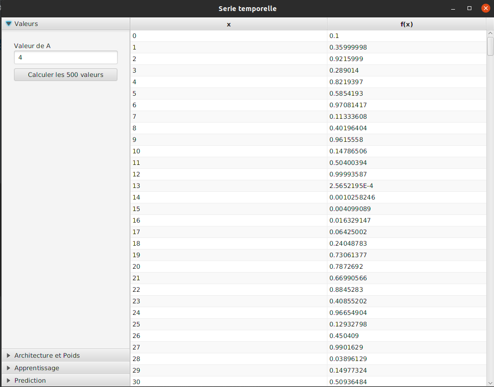
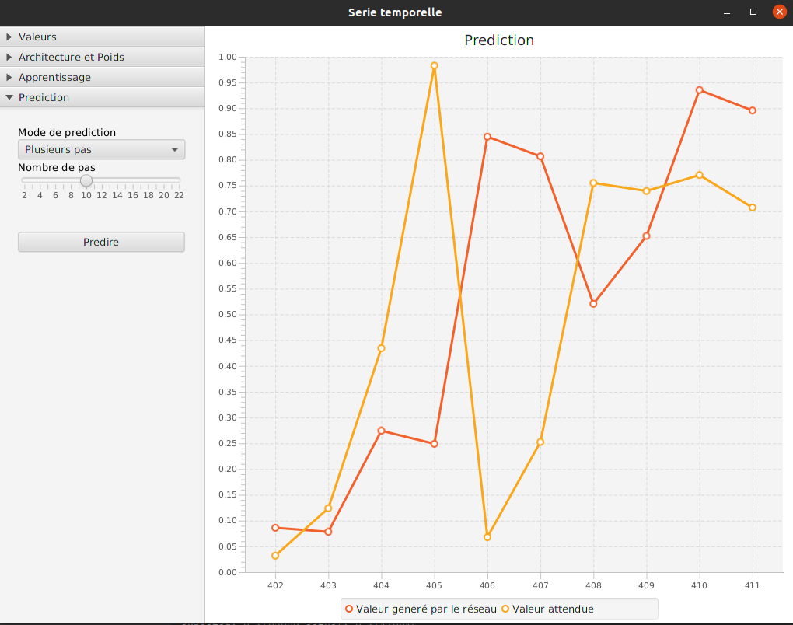

# PROJET IA PERCEPTRON MULTICOUCHE APPLIQUE UNE SERIE TEMPORELLE

## CONFIGURATION REQUISE
JAVA 11

## Screenshots
### Calcul 500 valeurs

### Calcul architecture optimale

### Apprentissage

### Prediction

